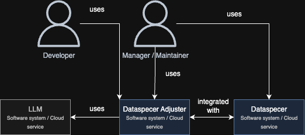
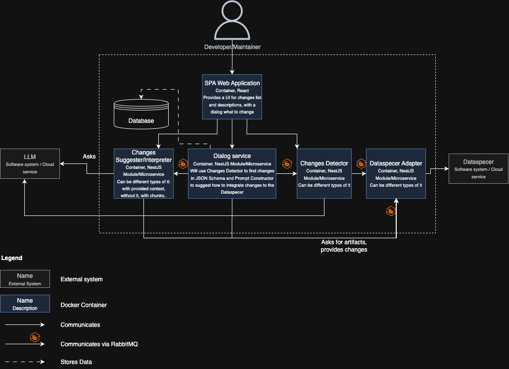
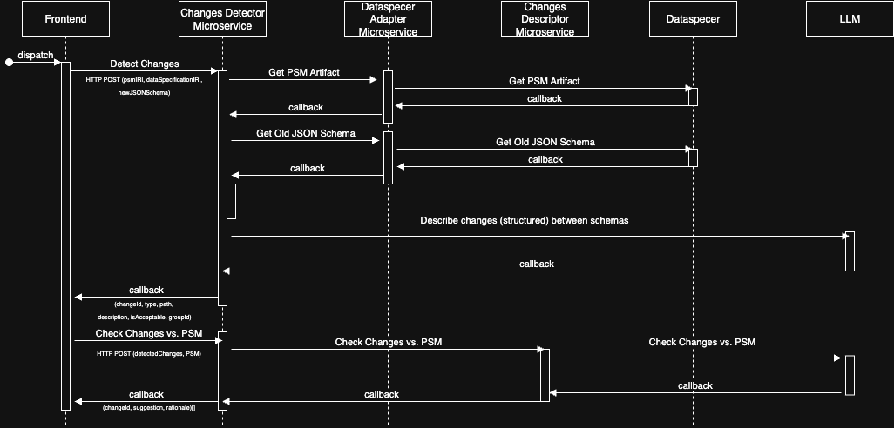
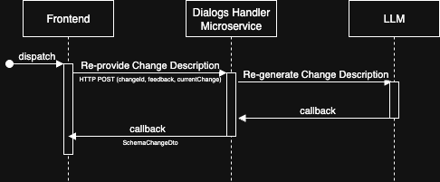
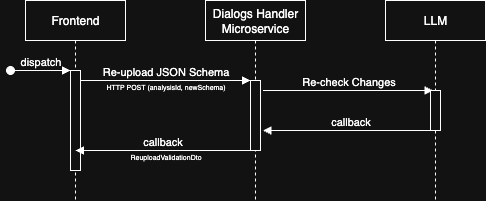
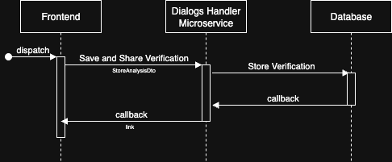
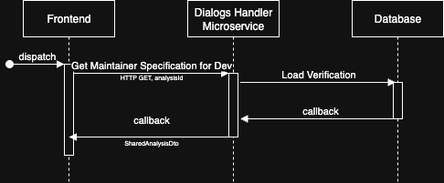

# Dataspecer Adjuster Service Documentation
This document aims to provide comprehensive documentation for the Dataspecer Adjuster service, focusing on its LLM-powered chat capabilities and backend architecture.
It is intended for developers, maintainers an project reviewers who want to understand, set up, and utilize the service effectively.

## Table of Contents
1. [Overview](#overview)
2. [Use Cases](#use-cases)
3. [Architecture](#architecture)
4. [Technologies Used](#technologies-used)
5. [Setup and Installation](#setup-and-installation)
6. [User Guide](#user-guide)
7. [API Reference](#api-reference)
8. [Prompt Engineering](#prompt-engineering)
9. [Examples](#examples)
10. [Evaluation and Testing](#evaluation-and-testing)
11. [Output of the project](#output-of-the-project)
12. [Fair AI Use Statement](#fair-ai-use-statement)

## Overview
Dataspecer is a tool designed for managing semantic data specifications—from vocabularies and application profiles to derived technical artifacts such as data schemas, validation rules, APIs, and application prototypes. Its goal is to offer an intuitive environment for designing data structures and semantics based on shared, easily accessible vocabularies. The tool is developed by a group within the Department of Software Engineering.

Currently, data specifications in Dataspecer must be built manually from scratch, requiring every structure and relationship to be explicitly defined. This process demands a deep understanding of both the tool and the associated data, which makes it challenging to reflect changes made elsewhere—such as updates to a database schema or API model class definitions—back into the specification. In practice, developers working on real-world APIs often prioritize functionality over semantics. The most they typically produce is an updated JSON Schema, which may no longer align with the original semantic design. For these users, the current semantics-first approach is not practical.

This project aims to develop a module that automatically checks existing specifications in Dataspecer when developers modify the associated JSON Schemas. The module will use both existing Dataspecer artifacts and the updated schemas to construct prompts for large language models (LLMs), which will analyze and summarize the changes. These changes will then be presented to the user as suggestions and, once confirmed, applied back to the Dataspecer specification via its API. By automating this feedback loop, the solution will minimize manual effort, improve the accuracy of semantic specifications, and ensure that API documentation remains consistent with the underlying implementation.

## Use Cases

Below are two primary use cases for the Dataspecer Adjuster service: one for specification maintainers and another for regular developers.

### Specification Maintainer Use Case
**Actor:**

Specification Maintainer 

**Stakeholders:**
Specification Maintainer, Developer, Development Team

**Goal:**

The Maintainer wants to compare a newly received JSON Schema with an existing specification in Dataspecer. The goal is to review suggested adjustments, decide which ones to apply, and identify which issues should be addressed directly in the JSON Schema by the development team.

**Actions:**

1.	The Maintainer obtains a new version of JSON Schema.
2.	The Maintainer selects the relevant specification from the list within Dataspecer.
3.	The Maintainer selects an appropriate PSM and clicks “Adjust” – after that redirected to the Adjuster.
4.	The Maintainer uploads the new version of the JSON Schema and clicks the "Analyze" button.
5.	The system processes the schema and presents the Change Summary page, consisting of:
  - Left panel: Displays the JSON Schema with highlighted changes:
    - Green for additions
    - Red for removals
    - Blue for renames or type changes
  - Each change is marked:
    - Acceptable changes
    - Problematic or potentially conflicting changes
  - Related changes are grouped together and identified with a group change ID, displayed in the top-right corner.
6.	The Maintainer can take the following actions for each listed change:
  - Accept the proposed adjustment to the specification
  - Reject the adjustment (optionally add a comment)
  - Mark as developer responsibility — the change is flagged for the development team, with a recommended action
7.	When reviewing changes, the Maintainer can:
  - Click on any change to see detailed suggestions and rationale
  - Preview how the updated specification would look with the accepted changes (in a visual/graphical view). In case Dataspecer API is not ready, provide a list of changes separately.
8.	Once satisfied, the Maintainer can:
  - Apply the accepted changes to the specification - apply to existing PSM / create new PSM
  - Export a developer feedback report listing all flagged issues with recommendations on how to adjust the JSON Schema
9.	Optionally, the Maintainer can generate a validation link (containing a key/token) to send to the Developer, allowing them to upload their schema and see how well it aligns with the specification, and also see feedback.

### Regular Developer Use Case

**Actor:**

Regular Developer

**Stakeholders:**

Developer, Development Team, Specification Manager

**Goal:**

The Developer wants to verify whether the changes they made to the JSON Schema are acceptable according to Dataspecer’s specification. If not, they want guidance on how to modify the schema to ensure compliance.

**Actions:**
1.	The Developer receives a special link from the Specification Maintainer. This link contains a unique token.
2.	The Developer opens the link and is presented with the initial screen.
3.	The Developer uploads their JSON Schema and clicks the "Check" button.
4.	The Developer is redirected to the Comparison Results page, which consists of two sections:
  - Left panel: Displays the JSON Schema with highlighted changes:
    - Green for additions
    - Red for removals
    - Blue for renames or type changes
  - Each change is marked:
    - Acceptable changes
    - Problematic or potentially conflicting changes
  - Related changes are grouped together and identified with a group change ID, displayed in the top-right corner.
5.	When the Developer clicks on a change, a detailed comment appears in the right panel. This may include a human-readable explanation and, in some cases, the corresponding code snippet from the JSON Schema.
6.	The Developer can click the "Re-import" button to return to the upload screen and repeat the process from step 2.


## Architecture
The Dataspecer Adjuster service is built using a microservices architecture, leveraging NestJS for the backend. 

### C4 Model Diagrams
Both users interact directly with the Web App, which communicates with DialogService, Changes Interpreter and Changes Detector. Manager/Maintainer also interacts with Dataspecer itself. Dataspecer Adjuster is integrated with Dataspecer. Dataspecer Adjuster also uses external service – LLM.



The service consists of several key components:
- **Dialogs Handler**: Manages user interactions and workflows, including review, acceptance, rejection, and sharing of changes. It also provides the LLM chat API and uses Postgres via Prisma for data storage.
- **Changes Detector**: Detects changes from raw schemas, from IRIs via Data Specification Validator, and hybrid modes.
- **Changes Suggester**: Generates suggestions and rationales based on detected changes and PSM (Platform Specific Model).
- **Dataspecer Adapter**: Acts as an adapter for the Dataspecer backend, handling ZIP exports and PSM fetches.
- **Shared Library**: Contains common DTOs for requests and responses, facilitating communication between services.
The LLM Chat functionality is integrated into the Dialogs Handler service, allowing specification maintainers to have AI-powered conversations about schema changes. The system uses OpenAI's GPT models to provide expert analysis and recommendations.



### Sequence Diagrams

Some of the key interactions within the system are illustrated in the following sequence diagrams:

#### Changes Detection and Description



Controller source code can be found here: [backend/apps/changes-detector/src/controllers/changes-detector.controller.ts](../backend/apps/changes-detector/src/controllers/changes-detector.controller.ts)

The goal of this interaction is to take two API schemas (old vs. new) together with a PSM reference and return a structured list of changes enriched with explanations and PSM‑aware checks.

- **Actors**: Frontend, Changes Detector Microservice, Dataspecer Adapter, Changes Descriptor Microservice, Dataspecer, LLM (optional).
- **Trigger**: Frontend submits an HTTP POST to `changes/*detections*` with either raw schema strings or IRIs (see `detectChangesHttp`, `detectChangesFromIriHttp`, `detectChangesHybridHttp`, `detectChangesAutomaticHttp`).
- **Happy path**:
  1. Changes Detector validates the request and orchestrates the pipeline.
  2. If IRIs are provided, it asks the Dataspecer Adapter to fetch the PSM artifact and/or the old JSON Schema from Dataspecer.
  3. It invokes the Changes Descriptor service to compute a structured diff between the old and the new schemas (type, path, description).
  4. The result is optionally cross‑checked against the PSM to identify mismatches and provide rationale/suggestions.
  5. The detector aggregates findings into `DetectedChangesDto` and returns them to the Frontend.
- **Output**: A list of changes with fields like `changeId`, `type`, `path`, `description`, `acceptable`, and machine‑readable rationale/suggestions suitable for later review.
- **Notes**: The controller exposes multiple entry points to support different integration styles—raw strings, IRIs, or hybrid. All converge to the same orchestration in `ChangesDetectorService`.

#### Regenerate Changes Description


Controller source code can be found here: [backend/apps/dialogs-handler/src/controllers/http/specification-maintainer/specification-maintainer.controller.ts](../backend/apps/dialogs-handler/src/controllers/http/specification-maintainer/specification-maintainer.controller.ts)

This flow lets a maintainer refine an individual change description using feedback and have the LLM regenerate a clearer, more actionable text.

- **Actors**: Frontend, Dialogs Handler (LLM Chat), LLM.
- **Trigger**: Frontend sends HTTP POST to `specifications/changes/regenerate-description` with `changeId`, free‑text `feedback`, and the `currentChange` payload.
- **Happy path**:
  1. Dialogs Handler forwards the current change and the maintainer’s feedback to the LLM via `LlmChatService`.
  2. The LLM produces an updated description (and may refine title/severity/impact).
  3. Controller returns `{ updatedChange }` to the Frontend.
- **Output**: `SchemaChangeDto` with an improved, consistent description suitable for user presentation and later sharing.
- **Notes**: This does not persist changes; it is an in‑place description refinement step in the review workflow.

#### Developer Reupload Verification


Controller source code can be found here: [backend/apps/dialogs-handler/src/controllers/http/specification-maintainer/specification-maintainer.controller.ts](../backend/apps/dialogs-handler/src/controllers/http/specification-maintainer/specification-maintainer.controller.ts)

After the maintainer shares an analysis, a developer can re‑upload a revised JSON Schema. This sequence validates that re‑upload against the previously shared analysis.

- **Actors**: Frontend, Dialogs Handler (LLM Chat), LLM.
- **Trigger**: Frontend sends HTTP POST to `specifications/analyses/:analysisId/reupload-validations` with `newSchema`.
- **Happy path**:
  1. Dialogs Handler loads the referenced shared analysis via `SpecificationMaintainerService.getSharedAnalysis`.
  2. It calls `LlmChatService.assessReuploadAgainstAnalysis`, providing the stored analysis and the new schema.
  3. The LLM compares the new schema with the accepted change set and produces a validation report (e.g., pass/fail per change, comments, missing pieces).
  4. Controller returns `ReuploadValidationDto` to the Frontend.
- **Output**: A developer‑focused report confirming whether the re‑upload satisfies the agreed changes, including actionable feedback when it doesn’t.

#### Share Link Generation


Controller source code can be found here: [backend/apps/dialogs-handler/src/controllers/http/specification-maintainer/specification-maintainer.controller.ts](../backend/apps/dialogs-handler/src/controllers/http/specification-maintainer/specification-maintainer.controller.ts)

This sequence persists an analysis result and produces a short link that can be shared with collaborators (e.g., developers).

- **Actors**: Frontend, Dialogs Handler, Database.
- **Trigger**: Frontend POSTs the analysis payload to `specifications/analyses/share`.
- **Happy path**:
  1. Dialogs Handler stores the analysis and metadata in the database via `SpecificationMaintainerService.storeAnalysis`.
  2. It generates a sharable URL (and token if applicable) and returns it to the Frontend.
- **Output**: `{ success, shareUrl }` that can be embedded in emails, tickets, or chat.
- **Notes**: The stored record is later used by the “Get Analysis via Link” and the developer re‑upload verification flows.

#### Get Analysis via Link


Controller source code can be found here: [backend/apps/dialogs-handler/src/controllers/http/specification-maintainer/specification-maintainer.controller.ts](../backend/apps/dialogs-handler/src/controllers/http/specification-maintainer/specification-maintainer.controller.ts)

This flow resolves a previously generated share link and returns the stored analysis so that any stakeholder can view the review context.

- **Actors**: Frontend, Dialogs Handler, Database.
- **Trigger**: Frontend sends HTTP GET to `specifications/analyses/:analysisId`.
- **Happy path**:
  1. Dialogs Handler reads the stored analysis by `analysisId` using `SpecificationMaintainerService.getSharedAnalysis`.
  2. The full `SharedAnalysisDto` is returned to the caller for rendering.
- **Output**: `SharedAnalysisDto` with all change items and decisions needed to understand the review.
- **Notes**: Access control can be implemented by pairing the `analysisId` with a tokenized URL when needed.

### Reasons for differences between specification and realization

The main difference between the specification and realization is that the Dataspecer is not fully integrated as described in the original specification - not all features are implemented in the core Dataspecer application. The Dataspecer Adjuster service is designed to work with the existing capabilities of Dataspecer, which may not cover all aspects of the specification.

Aslo, the frontend application communicates with different microservices instead of only communicating with the Dialog Handler. This seems to be more robust and allows better separation of concerns (not all communication flows through the dialog service, avoiding a potential bottleneck), but it is not fully aligned with the original specification.

LOV is not also integrated on the current stage, but it is planned for future releases in the Diploma thesis - the current implementation tries to deal with at least the context of JSON schemas and Dataspecer artifacts.

## Technologies Used
- **NestJS**: A progressive Node.js framework for building efficient and scalable server-side applications.
- **TypeScript**: A strongly typed programming language that builds on JavaScript, providing better tooling and error checking.
- **PostgreSQL**: An open-source relational database management system used for data storage.
- **TypeORM**: An ORM (Object-Relational Mapping) tool that simplifies database access and management.
- **RabbitMQ**: A message broker that facilitates communication between microservices.
- **OpenAI GPT Models**: Used for generating suggestions, rationales, and facilitating chat interactions.
- **LangChain**: A framework for developing applications powered by language models, used to integrate with OpenAI. 
- **Next.js**: A React framework for building user interfaces, used in the frontend component.
- **Tailwind CSS**: A utility-first CSS framework for styling the frontend components.
- **Nginx**: A web server used as a reverse proxy for the application.
- **Docker**: A platform for developing, shipping, and running applications in containers, used for deployment.

### Technologies choice rationale
Dataspecer itself is developed on NodeJS and TypeScript, so using NestJS for the backend services ensures consistency in the technology stack. NestJS provides a modular architecture that is well-suited for building microservices, making it easier to manage and scale the application. Potentially other languages and frameworks could be used because of performance, more robust parallel computing (e.g.,C# + .NET, Java + Spring Boot or C++ + Boost), but that would introduce additional complexity in terms of deployment and maintenance.

PostgreSQL is chosen for its robustness, scalability, and strong support for complex queries, which is essential for managing the structured data involved in schema changes and suggestions, and, what is important, because it is Open Source. TypeORM is used to simplify database interactions and provide a higher-level abstraction for working with the database instead of Prisma, which is also a good option, but TypeORM os simplier and is enough for the project needs.

RabbitMQ is used for its reliability and support for complex messaging patterns, which is crucial for the asynchronous communication between microservices. OpenAI GPT models are selected for their advanced natural language processing capabilities, enabling the generation of meaningful suggestions and rationales. LangChain is used to streamline the integration with OpenAI, providing a higher-level abstraction for working with language models.

Next.js is chosen for the frontend due to its server-side rendering capabilities and ease of building React applications. Tailwind CSS is used for its utility-first approach, allowing for rapid UI development with consistent styling. Docker is employed to containerize the application, ensuring that it runs consistently across different environments and simplifying deployment.

The aplication is dockerized into multiple containers mainly for study purposes, to demonstrate microservices architecture and to allow independent scaling of components. In a production environment, a monolithic approach could be considered for simplicity, depending on the specific requirements and scale of the application. Transfer between multimodular monolithic and microservices architecture is relatively straightforward with NestJS, as it supports both paradigms effectively.

## Setup and Installation
### Prerequisites
1. **Node.js**: Ensure you have Node.js (version 20 or higher) installed on your machine.
2. **Docker**: Install Docker to run the services in containers, including docker-compose for orchestration.
3. **OpenAI API Key**: Obtain an OpenAI API key for accessing GPT models.

### How to Run Locally
To run the Dataspecer Adjuster service locally, follow these steps:

1. Open a terminal and navigate to the `services/adjuster` directory.
2. Create a `.env` file in the `services/adjuster` directory with the content of example
3. Run the following command to start the services using Docker Compose in dev mode with hot reload:
   ```bash
   docker-compose up --build
   ```

   or
    ```bash
    docker compose up --build
    ```

    For optimized version with build and runtime stages without hot reload run:

    ```bash
    docker compose -f docker-compose.prod.yml up -d --build
    ```

    or

    ```bash
    docker-compose -f docker-compose.prod.yml up -d --build
    ```

    depending on your Docker installation.

    Sometimes build of the Dataspecer itself can fail because of the memory - in this case try to kill some other processes or increase the memory limit in Docker settings, and run 

    ```bash
    docker compose -f docker-compose.prod.yml build dataspecer
    ```
    or

    ```bash
    docker-compose -f docker-compose.prod.yml build dataspecer
    ```
    separately first, and then run the full command again.
4. The services will be accessible at the following ports:
   - Dialogs Handler: `http://localhost:3100`
   - Changes Detector: `http://localhost:3101`
   - Changes Suggester: `http://localhost:3102`
   - Dataspecer Adapter: `http://localhost:3104`
   - RabbitMQ Management UI: `http://localhost:15672` (default credentials: guest/guest)
   - PostgreSQL Database: `localhost:5432` (default credentials: adjuster/adjuster123)
5. The frontend application can be accessed at `http://localhost:3001`.

## User Guide
This section provides a guide on how to use the Dataspecer Adjuster service.

### Maintainer Workflow
1. Navigate to the frontend Dataspecer application at `http://localhost:3002`.
2. Upload a specification or select an existing one. (Example is provided).
3. Click on "Check Changes" button on PSM to initiate the change detection process.
4. You will be transferred to the Adjuster interface, where you upload your new JSON schema.
5. Click "Detect Changes" to analyze the differences between the old and new schemas.
6. Review the detected changes, which will be categorized and explained.
7. Use the chat feature to discuss changes with the AI assistant or refine change descriptions.
8. Provide feedback on individual changes for developers.
9. Once satisfied, click "Share Analysis" to generate a shareable link for developers.
10. Copy the generated link and share it with your development team for implementation.
11. See a summary of accepted/rejected changes on a special page.

### Developer Workflow
1. Receive the shareable link from the maintainer.
2. Open the link in your browser to view the analysis and suggested changes.
3. Review the changes and their explanations.
4. Make the necessary updates to your JSON schema based on the suggestions.
5. Re-upload the updated JSON schema using the provided interface.

## API Reference
The Dataspecer Adjuster service exposes several API endpoints for interacting with the system. Each microservice serves a Swagger UI for easy exploration and testing of the API endpoints. For each service, you can access the Swagger UI at the following URLs:
- Dialogs Handler: prod `http://localhost:3000/dialogs-handler/api/docs` or dev `http://localhost:3100/api/docs`
- Changes Detector: `http://localhost:3000/detector/api/docs` or `http://localhost:3101/api/docs`
- Changes Suggester: `http://localhost:3000/suggester/api/docs` or `http://localhost:3102/api/docs`
- Dataspecer Adapter: `http://localhost:3000/adapter/api/docs` or `http://localhost:3104/api/docs`

## Prompt Engineering
Prompt engineering is a critical aspect of leveraging large language models (LLMs) effectively. In the context of the Dataspecer Adjuster service, prompts are carefully crafted to guide the LLM in generating relevant and accurate responses for change detection, description, and chat interactions.

Prompts can be found in the specific file [prompts.json](../backend/libs/common/src/config/prompts.json). Here are the prompts used:

### Changes Detector

- **jsonDiffTemplate**
```text
You are a data model expert who tries to control how the data are used in JSON Schemas regarding vocabularies (for example OWL). Analyze JSON  differences and categorize changes.

IMPORTANT: Provide a valid, complete JSON response. Limit your analysis to the most significant changes if there are many.

Task:
1. Categorize each difference: addition, removal, rename, type-change
2. Assess PSM compliance for each change - there is some vocabulary behind PSM, which describes the data model of the API with usage of OWL, LOD etc.

For each change provide (ALL FIELDS MUST BE PRESENT):
- changeId: unique string identifier
- type: array of change types
- path: JSONPath to element
- description: brief explanation
- isAcceptable: boolean for PSM compliance
- groupId: string or null (use null if no grouping)

Differences:
{differences}

PSM Schema:
{psm}

Return only valid JSON with the changes array.
```

- **fallbackTemplate**
```text
Analyze API specifications to identify differences.

IMPORTANT: Provide a valid, complete JSON response. Limit analysis to significant changes only.

Task:
1. Find differences between old and new API
2. Categorize: addition, removal, rename, type-change  
3. Assess PSM compliance

For each change (ALL FIELDS MUST BE PRESENT):
- changeId: unique identifier
- type: array of change types
- path: JSONPath to changed element
- description: brief explanation
- isAcceptable: boolean for PSM compliance
- groupId: string or null (use null if no grouping)

API Data:
{differences}

PSM Schema:
{psm}

Return only valid JSON with changes array.
```

### Changes Suggester

- **suggestionsTemplate**
```text
You are provided with a list of changes detected in an API specification and a PSM context (selected relevant chunks).
Changes (JSON): {changes}
PSM context: {psm}

For each change, provide:
- A suggestion for how to handle the change
- A rationale explaining why this suggestion is appropriate

Constraints:
- Keep responses concise and actionable
- Assume the PSM text may be truncated; do not rely on missing context

Consider:
1. Impact on existing systems
2. Backward compatibility
3. Best practices for API design
```

### Specification Processor

- **describeChangesTemplate**
```text
Describe the changes made to the artifact. 
Original: {original} 
Updated: {updated}
```

- **schemaDifferencesTemplate**
```text
You are provided with two JSON schemas.
      Old JSON schema: {oldSchema}
      New JSON schema: {newSchema}
      PSM Artifact: {psm}

      Your task is to compare the two schemas and identify the changes between them. There may be alternatives - mark them via 
      alternativeChangeId, for example - addedProperties in combination with removedProperties vs. changedProperties, 
      you do not know for sure if it is a complitley new property or just renaming. Also take into account relatedChangeId - 
      an array of changeId, for example if a new class added, addedClasses will contain chnageId's of 
      related addedProperties and vice-versa. Describe the changes in a human-readable format.
      Return a JSON object with array of following properties:

      "addedProperties",
      "removedProperties",
      "changedProperties",
      "addedClasses",
      "addedConnections",
      "removedConnections",
      "removedClasses",
      "changesDescription"
```

- **definitionsTemplate**
```text
You are provided with a PSM artifact and two API specifications.
      PSM Artifact: {psm}
      Old API: {oldApi}
      New API: {newApi}
      Action: {action}
      Artifact Format: {artifactFormat}

      Your task is to analyze the changes between the old and new API specifications and provide a detailed description of the changes.
      Focus on identifying:
      1. Added properties, classes, and connections
      2. Removed properties, classes, and connections
      3. Changed properties and their types
      4. Any structural changes in the API

      Provide a clear and concise description of all changes.
```

To get structured JSON responses from the LLM, we use ZOD schemas.

## Examples

To test the project, you can use the provided example JSON schema and the Dataspecer package located in the `services/adjuster/documentation/examples` directory. These examples include:
 - `Rejstřik svazků obci.zip`: A sample Dataspecer package that can be imported into the Dataspecer application.
 - `new-schema.json`: The original JSON schema before changes.

 For this example, the following changes were made to the `new-schema.json`:
 - Modified `souřadnice` property to have lat and lon fields inside instead of a string.
 - Made `souřadnice` property required.
 - Type of `vznik` property changed from string to number.
 - For field `ič_obce` of type array, items type changed from string to number.

 There is also `new-schema-2.json` file, which contains additional changes:
 - removed en for Právní důvod zrušení.
 - poštovní směrovací číslo renamed to PSČ.
 - PSČ made of integers.

 ## Evaluation and Testing

 ### Evaluation
 The evaluation part for the project phase is rather minimal, as the main focus is on development and implementation. However, the effectiveness of the Dataspecer Adjuster service can be assessed based on its ability to accurately detect and describe changes in JSON schemas, as well as the quality of suggestions provided by the LLM.
The effectiveness of the Dataspecer Adjuster service can be evaluated based on several criteria:
- **Accuracy of Change Detection**: The service should accurately identify and categorize changes between JSON schemas, including additions, removals, renames, and type changes.
- **Quality of Suggestions**: The suggestions provided by the LLM should be relevant, actionable, and aligned with best practices for API design.

Based on the examples provided, the service successfully detected and categorized the changes made to the JSON schema. The suggestions generated were relevant and provided clear guidance on how to handle each change. However, the following issues were found:
- If there is a field which changed name and type at the same time, sometimes the LLM does not recognize rename - only type change, or vice versa.
- In some cases, the LLM provided suggestions that were too generic and not specific enough to the context of the PSM.
- Addition of lon and lat fields inside souřadnice was not recognized as addition of new properties, but rather as a change of the souřadnice property itself.


 ### Integration Tests
The Dataspecer Adjuster service includes a suite of integration tests to ensure the reliability and correctness of its functionality. Tests are written using Jest and can be found in the `test` directories within each microservice.

The tests cover mian scenarios of communicating with each microservice separately via HTTP endpoints. The tests do not include the full dockerized setup, but rather focus on individual services to ensure their correctness in isolation, even if the scenarios are not fully end-to-end.

To run the tests, navigate to the `services/adjuster/backend` directory and execute the following commands:
```bash
npm install
```

```bash
npm run test:e2e:dialogs
```
```bash
npm run test:e2e:detector
```
```bash
npm run test:e2e:suggester
```
```bash
npm run test:e2e:adapter
```

## Output of the project
The project is a tool which makes it possible to check the theory how LLMs can be used to maintain real world data specifications in Dataspecer and their usage. The project is not fully production-ready, but it demonstrates the core concepts and provides a foundation for further development and integration.

## Fair AI Use Statement
The Dataspecer Adjuster service utilizes OpenAI's GPT models to enhance its capabilities in detecting and describing changes in JSON schemas. The use of AI is intended to assist users in understanding complex schema modifications and to provide suggestions based on best practices.

During the implementation, AI-powered IDEs like VS Code + GitHub Copilot and Cursor were used to improve productivity and code quality. Scenarios of usage include:

- Generating boilerplate code for NestJS controllers and services.
- Improving prompts for LLM interactions.
- Writing integration tests after the main logic was implemented - based on author's description of the functionality and design and base authors code.
- Refactoring existing code for better readability and maintainability (mainly lines, spaces, methods separation, names consistency).

All AI-generated content was reviewed and modified by the student to ensure accuracy and relevance to the project requirements. Design of the project - architecture, data models, APIs, core services logics and overall functionality - was solely the work of the student.
